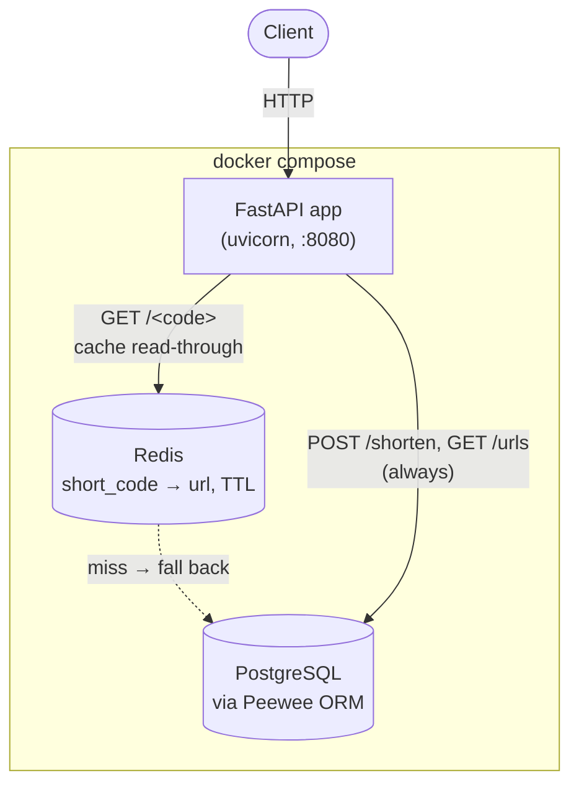
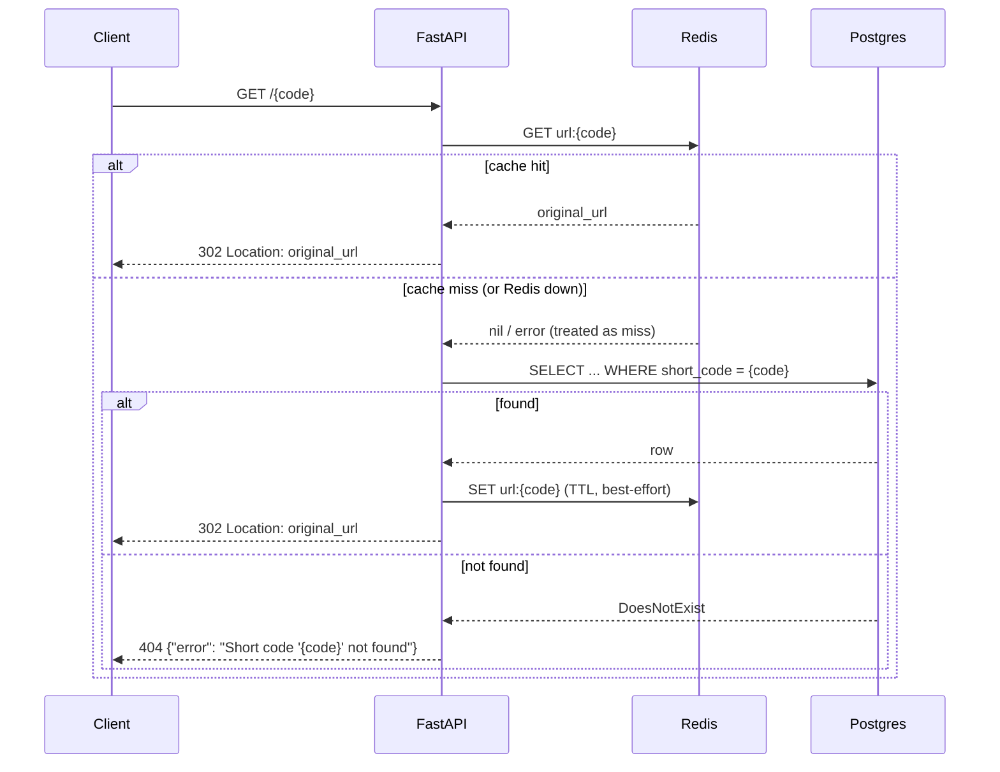
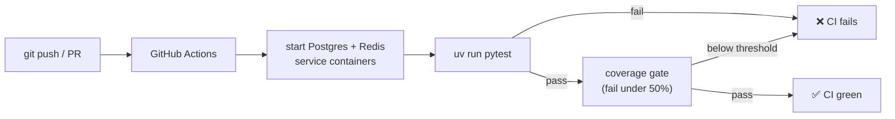

# PE Hackathon — URL Shortener

A production-hardened URL shortening service built for the MLH Production Engineering Hackathon.

**Track:** Reliability Engineering  
**Stack:** FastAPI · Peewee ORM · PostgreSQL · Redis · pytest · GitHub Actions


---

## Setup

### Prerequisites
- Python 3.13+
- PostgreSQL running locally (or Docker)
- Redis running locally (or Docker)
- [uv](https://docs.astral.sh/uv/) installed

```bash
# macOS / Linux
curl -LsSf https://astral.sh/uv/install.sh | sh

# Windows (PowerShell)
powershell -ExecutionPolicy ByPass -c "irm https://astral.sh/uv/install.ps1 | iex"
```

### Quick Start

```bash
# 1. Clone
git clone https://github.com/AjayMaan13/pe-hackathon-2026.git
cd pe-hackathon-2026

# 2. Install dependencies
uv sync

# 3. Create database + start Redis
createdb hackathon_db
# OR with Docker:
# docker run --name hackathon-db -e POSTGRES_PASSWORD=postgres -e POSTGRES_DB=hackathon_db -p 5432:5432 -d postgres
redis-server --daemonize yes
# OR with Docker:
# docker run --name hackathon-redis -p 6379:6379 -d redis:7

# 4. Configure
cp .env.example .env
# Edit .env if your DB/Redis settings differ

# 5. Run
uv run uvicorn run_fastapi:app --reload --host 0.0.0.0 --port 8080
```

Visit http://localhost:8080/health — should return `{"status": "ok"}`

Interactive API docs (auto-generated by FastAPI) are at http://localhost:8080/docs

### Run with Docker (app + Postgres + Redis, auto-restart on crash)

```bash
docker compose up --build
```

Visit http://localhost:8081/health

---

## API Endpoints

| Method | Endpoint | Description |
|--------|----------|-------------|
| GET | `/health` | Service health check |
| POST | `/shorten` | Shorten a URL |
| GET | `/<code>` | Redirect to original URL |
| GET | `/urls` | List all shortened URLs |

### POST /shorten

**Request:**
```json
{ "url": "https://example.com/very/long/path" }
```

**Response (201):**
```json
{
  "short_code": "aB3xZ9",
  "short_url": "http://localhost:8080/aB3xZ9",
  "original_url": "https://example.com/very/long/path"
}
```

**Errors:**
- `400` — Missing or invalid URL
- `500` — Server error

---

## Running Tests

```bash
uv run pytest tests/ -v
```

With coverage:
```bash
uv run pytest tests/ --cov=app --cov-report=term-missing
```

---

## Environment Variables

| Variable | Description | Default |
|----------|-------------|---------|
| `DATABASE_NAME` | PostgreSQL database name | `hackathon_db` |
| `DATABASE_HOST` | PostgreSQL host | `localhost` |
| `DATABASE_PORT` | PostgreSQL port | `5432` |
| `DATABASE_USER` | PostgreSQL user | `postgres` |
| `DATABASE_PASSWORD` | PostgreSQL password | `postgres` |
| `REDIS_HOST` | Redis host | `localhost` |
| `REDIS_PORT` | Redis port | `6379` |
| `REDIS_TTL_SECONDS` | Cache TTL for short-code lookups | `3600` |

---

## Architecture



### API Request Flow — `GET /<code>`



### CI Pipeline



---

## Project Structure

```
pe-hackathon-2026/
├── app/
│   ├── fastapi_app.py       # FastAPI app factory + entry point
│   ├── api/
│   │   └── routes.py        # All 4 endpoints
│   ├── schemas.py           # Pydantic request/response models
│   ├── cache.py             # Redis read-through cache for GET /<code>
│   ├── database.py          # Peewee/Postgres connection wiring
│   └── models/
│       └── url.py           # URL model + short code generator
├── tests/
│   ├── conftest.py          # pytest fixtures
│   ├── test_fastapi_*.py    # Endpoint + cache integration tests
│   ├── test_cache.py        # Redis cache module unit tests
│   └── test_schemas.py      # Pydantic schema tests
├── docs/
│   ├── MIGRATION_PLAN.md    # Flask -> FastAPI + Redis migration history, phase by phase
│   ├── ERROR_HANDLING.md    # Error codes and response formats
│   └── FAILURE_MODES.md     # What happens when things break
├── .github/workflows/
│   └── test.yml             # CI — runs tests + coverage on every push
├── Dockerfile              # Container definition (runs the app via uvicorn)
├── docker-compose.yml      # App + Postgres + Redis, all with auto-restart
├── .dockerignore
├── setup_db.py             # One-time table creation script
└── run_fastapi.py          # Entry point (uvicorn)
```

---

## Troubleshooting

See [docs/TROUBLESHOOTING.md](docs/TROUBLESHOOTING.md)

---

## Reliability Features

- **Health endpoint** — `GET /health` always returns 200 if the service is up
- **Input validation** — rejects malformed URLs with a 400 JSON error, never crashes
- **31 automated tests** — unit + integration coverage across all endpoints and the cache layer
- **98%+ test coverage** — measured with pytest-cov, enforced in CI
- **GitHub Actions CI** — tests run on every push (Postgres + Redis services), fails if coverage drops below 50%
- **Docker restart policy** — `restart: always` auto-recovers from crashes in ~0.2-5 seconds (measured against the live container, not just the failure-mode doc's estimate)
- **Graceful errors** — all errors return JSON, no stack traces exposed to users
- **Redis cache with a measured payoff** — `GET /<code>` reads through a Redis cache in front of Postgres, TTL-bound and warmed on write. Measured against the deployed `docker compose` stack (50 requests each, median): **~12ms Postgres-only vs ~3.5ms with a cache hit — about 3.4x faster, and a cache hit issues zero Postgres queries** (enforced by a test that fails if Postgres is touched on a hit). Redis errors are caught and treated as a cache miss, so an outage degrades to Postgres-only rather than failing the request — see `docs/FAILURE_MODES.md`.
